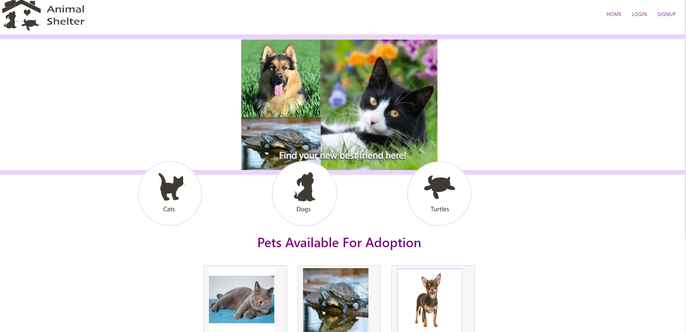
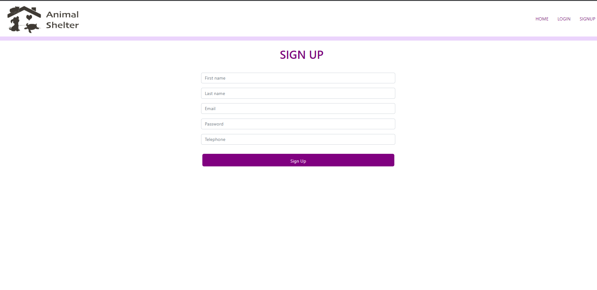
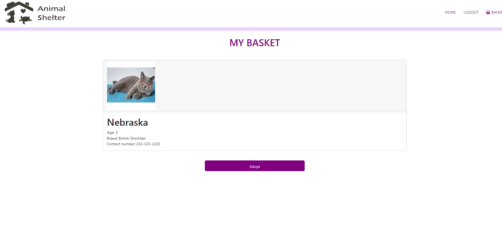

[](https://opensource.org/licenses/MIT)

https://opensource.org/licenses/MIT

# Pet Adoption Website

## Description 
This is a e-commerce website created to help pets in need to find a forever home. It was designed with ease of access so that users can easily see different pets and their information and choose their favorite.

## Installation  
```md
Run mysql -u root -p < db/schema.sql
Run npm i in Terminal 
Rename .env.EXAMPLE to .env and fill in the blank spaces 
Run the seed file with nmp run seed command in the terminal
```
## Technologies
This website was made by connecting the dynamic and responsive front-end using HTML, CSS (Bootstrap) and JavaScript, to the responsive and interactive back-end using Handlebars.js (as the template engine), MySQL and the Sequelize ORM (for the database), GET and POST routes (for adding new data and retrieving), utilizing session authentication. This website is powered by Heroku.

## Screenshots 

The following images show the mock-up of the generated HTML’s appearance and functionality:








## Demo Video

https://drive.google.com/file/d/1CVRPSa0GeJAWadEBC_T2Ddlbbtc8RL6-/view

## Usage  
Go to signup in the nav bar to create an account, log in with email and password provided, click add to basket to add a rescue to your cart, follow the instructions to finish de adoption process !

## Contributing 
Contact the developers to participate !

## Tests
no tests were written for this project

## License
This application is covered by the MIT license

## Questions
https://github.com/EliasAllan
https://github.com/SaadYousafi87
https://github.com/4ng3lic4
https://github.com/nayonnapurnell
https://github.com/FatemehNiaz

or

E-mail me at: allanrnelias@gmail.com

## Table of contents
- [Description](#description)
- [Installation](#installation)
- [Technologies](#technologies)
- [Screenshots](#screenshots)
- [Demo Video](#demo-video)
- [Usage](#usage)
- [Contributing](#contributing)
- [Tests](#tests)
- [License](#license)
- [Questions](#questions)


## Link to deployed application

https://pet-adoption-store.herokuapp.com/