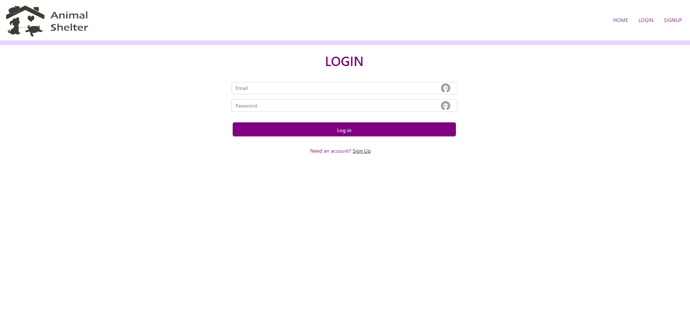

# pet-adoption-website

## Your Task
As a full-stack web developer, create a pet-adoption website by making and connecting the dynamic and responsive front-end using HTML, CSS (Bootstrap) and JavaScript, to the responsive and interactive back-end using Handlebars.js (as the template engine), MySQL and the Sequelize ORM (for the database), GET and POST routes (for adding new data and retrieving), which has (cookies and express session) authentication, then deploy it using Heroku.


## User Story

```md
AS A full-stack web developer
My goal is to generate a webpage that displays a pet-adoption online shop.
SO THAT users can easily see different pets with their information, choose their favorite one and by adding the pet to the cart and paying the adoption fee, they adopt it
```

## Acceptance Criteria

```md

GIVEN a command-line application which displays Homepage, Navigation Bar with different functional and responsive buttons for Home, Login, Signup, And different Animal Kind (Dog, Cat, Turtle)
GIVEN a command-line application that displays Pet's Cards and their picture and information 

THEN in Pets' card, where pet's Picture, Name, Age and Breed are displayed, user should be able to see the Add to Cart button

WHEN the User clicks on the Add to Cart button, it takes the User to Cart page for payment

GIVEN a command-line application which accepts users input to be able login or signup in cart page in order to pay and finish the adoption process

WHEN the User clicks to finish the shopping process, User requires to login by entering the Email and password

WHEN User enters the Email and password to login, if the acount already exists, User is able to continue the shopping process

WHEN The User enters the username and password, if it doesn't exist, THEN the page takes the User to the signup page
WHEN taken to signup page, User should be able to enter the First Name, Last Name, Email, Password and Telephone Number in order to signup.

```

## Mock-Up

The following images show the mock-up of the generated HTML’s appearance and functionality:





## License 
© 2022 MIT License. All Rights Reserved.

